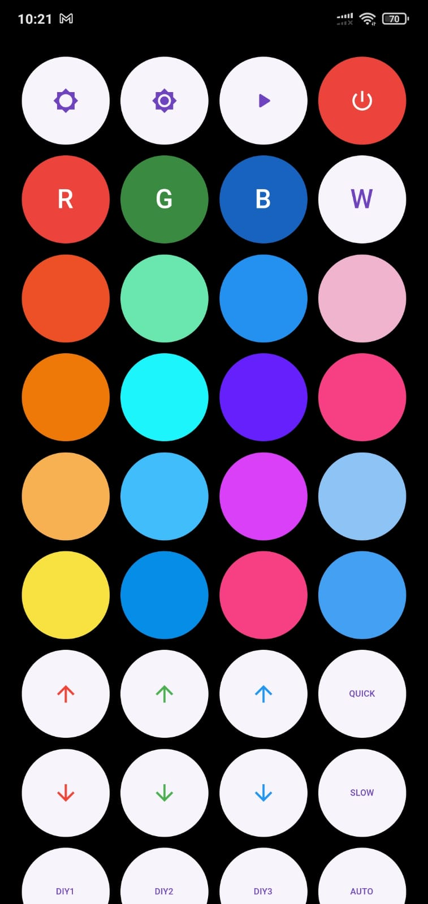

# Flutter LED Controller App

**Description:**
An intuitive Flutter application designed for controlling generic 44-key LED light strips.

**Features:**
- RGB color control
- Lighting mode selection
- Brightness and speed adjustment
- User-friendly interface

**Screenshot:**

**Usage Instructions:**
1. Clone the repository: `git clone https://github.com/your-username/your-repository.git`
2. Install dependencies: `flutter pub get`
3. Run the app: `flutter run`

**Compatibility:**
Compatible with 44-key LED light strips. Tested on Android devices.

**Contributions:**
Contributions are welcome! If you encounter bugs or have improvements, feel free to open issues or submit pull requests.

**License:**
This project is licensed under the MIT License.

**Acknowledgements:**
Thank you for using the Flutter LED Controller App!

**Author:**
Lucas Alestério
